# This is a raytracing engine built from scracth with v lang as part of a course work.

Rendered Images
----------------

sphere

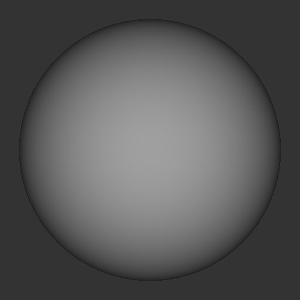

sphere_ambient

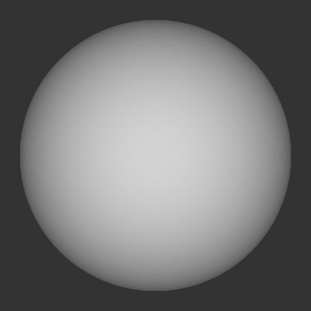

sphere_room

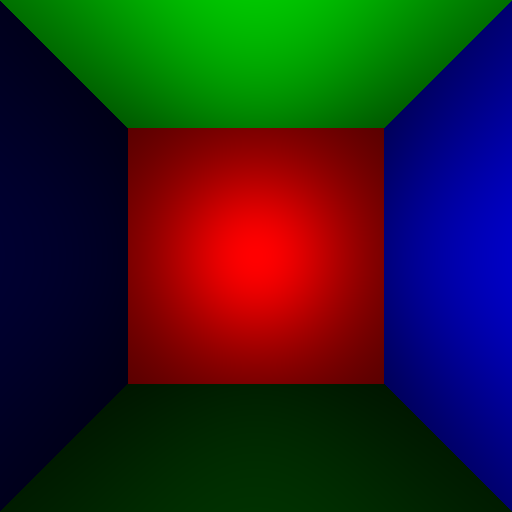

quad

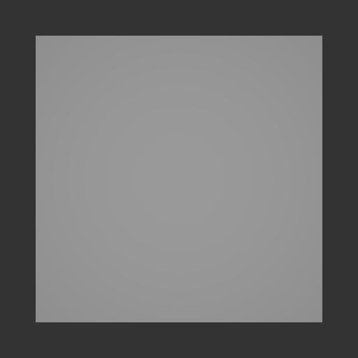

quad room

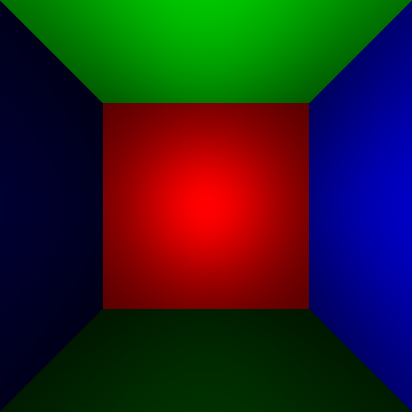

ball on plane

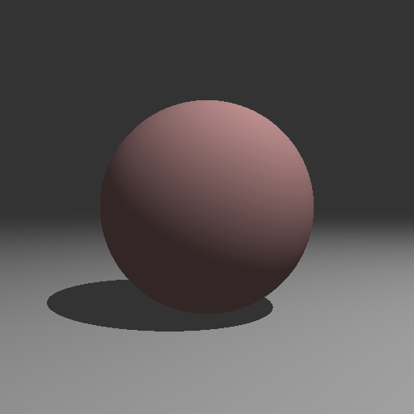

balls on plane

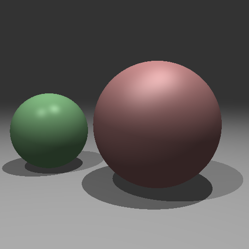

reflections

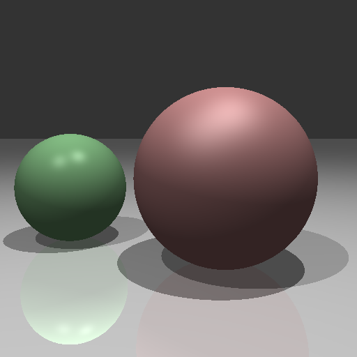

antialiased

elective1: triangle

Implemented using the slide.

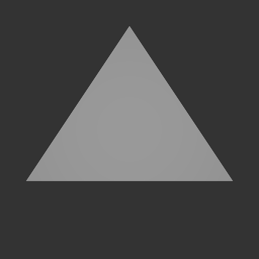

elective2: glass

Implemented using the slide.

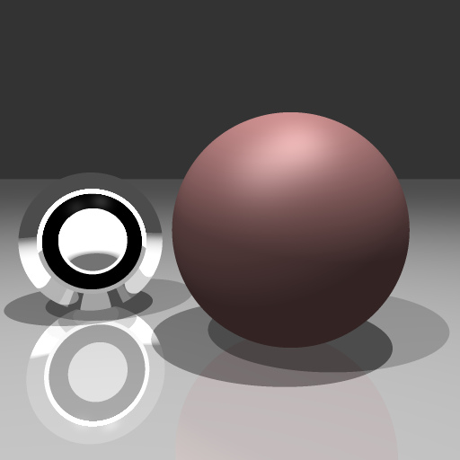

creative artifact: ico sphere

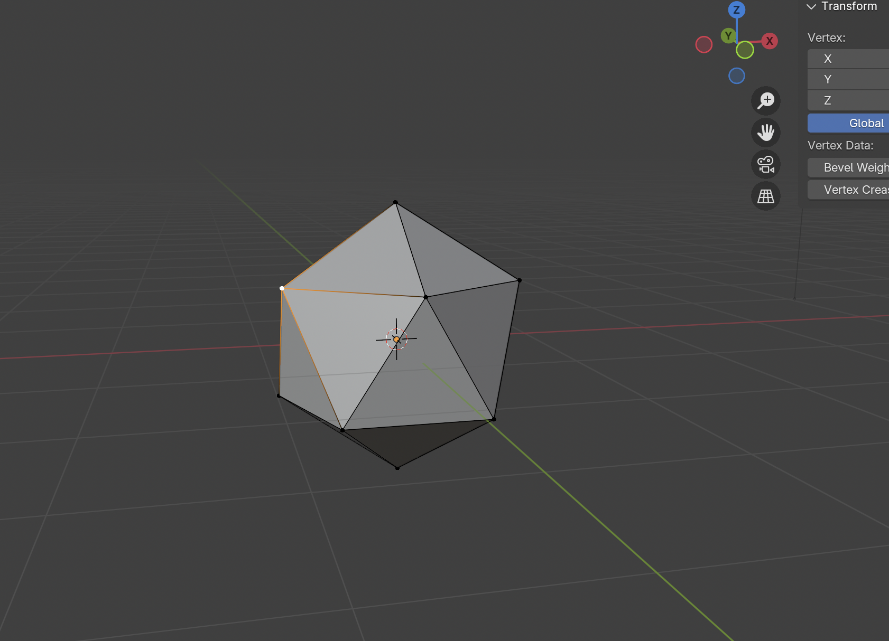
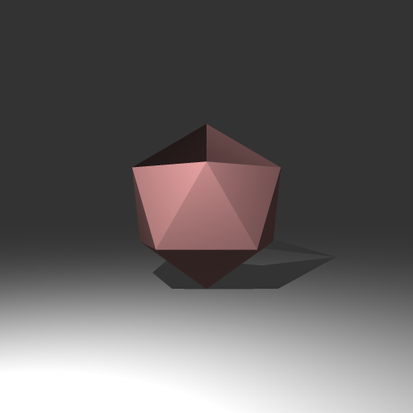

<!--   Leave the following Markdeep formatting code, as this will format your text above to look nice in a wed browser   -->

